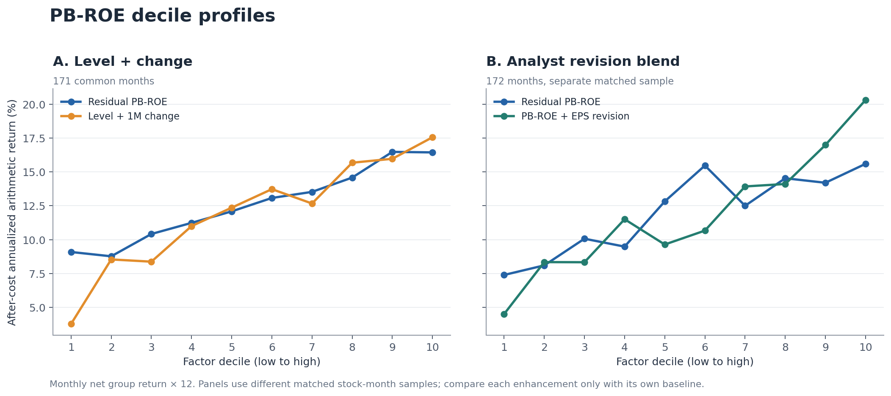

# PB-ROE / DDM Expected-Return Factor for A-Shares

Point-in-time factor research that turns a PB-ROE valuation relationship into
an implied annualized capital-gain signal, removes industry/size/beta
exposures, and tests valuation changes and analyst EPS revisions.



## What this project demonstrates

- A valuation kernel with an actual fiscal-year horizon, long-run growth
  assumptions, a cost-of-equity safety bound, and explicit failure reasons.
- Reconstruction of broker consensus from report-level forecasts using only
  records observable by the signal date, with at least two brokers.
- Monthly cross-sectional OLS residualization against Shenwan level-1
  industry, log market value, and trailing beta.
- Next-open, stateful ten-decile backtests with blocked trades and explicit
  commissions/tax; separate Rank IC, monotonicity, spread and risk analysis.
- A frozen, sequential enhancement test that retains failed candidates and
  distinguishes research evidence from production approval.

## Headline results

| Comparison | Mean monthly Rank IC | Annualized ICIR | After-cost G10-G1 annualized |
|---|---:|---:|---:|
| Residual PBROE standalone, 172 months | **0.03354** | **1.595** | **7.56%** |
| Level + one-month change, 171-month R0/R1 sample | **0.04538** | **1.990** | **13.78%** |
| PBROE + analyst revision, separate 172-month matched sample | **0.03966** | **1.699** | **15.80%** |

These rows use different stock-month samples. The level/change version failed
the pre-registered turnover gate (G10 turnover rose to 158% per month), so the
residual PBROE level remains the governed baseline. Neither enhancement is
claimed as a live production strategy. See [results](docs/RESULTS.md) for
baselines, Sharpe, decile monotonicity, statistical tests, and sample sizes.

## Run locally

Python 3.11 or later:

```bash
python -m pip install -e ".[dev]"
python -m pytest
python examples/synthetic_demo.py
python examples/verify_published_results.py
```

The demo creates 18 **synthetic** stocks and broker forecasts, then executes
consensus reconstruction, PBROE valuation, residualization, and the analyst
revision blend. It needs no API key or market data. The published-results
verifier recalculates key metrics from included aggregate monthly series.
To regenerate the figure, install `.[plots]` and run
`python examples/plot_results.py`.

## Repository guide

| Path | Content |
|---|---|
| [`src/pbroe/`](src/pbroe/) | PIT universe, broker forecasts, ROE, valuation, beta, residualization, revisions, execution and metrics |
| [`tests/`](tests/) | Formula, date-boundary, eligibility, execution and data-contract tests |
| [`examples/`](examples/) | Synthetic end-to-end demo and aggregate-results verifier |
| [`results/`](results/) | Published summary and monthly aggregate series without vendor rows or stock identifiers |
| [`config/`](config/) | Versioned growth and cost-of-equity assumptions |
| [Methodology](docs/METHODOLOGY.md) | Formula, timing, signals, labels and portfolio definitions |
| [Data and reproducibility](docs/DATA_AND_REPRODUCIBILITY.md) | Full rerun inputs and redistribution boundary |
| [Limitations](docs/LIMITATIONS.md) | Unresolved model, execution and out-of-sample risks |

The original spreadsheet, sell-side reports, stock-level data, and vendor
credentials are not redistributed. Full historical stock-level reproduction
requires separately licensed point-in-time inputs. This repository provides
working code, tests, synthetic inputs, and auditable aggregate results.
